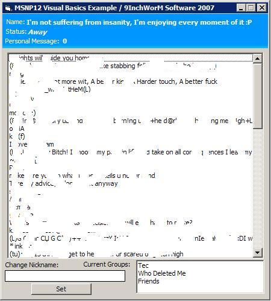



## MSNP12 VB Example

### Description

I put this code together in just under an hour. It's just a simple example of how to connect to MSN via Visual Basics using the MSNP12 Protocol.

Not all of the code is mine, and I have added credits where due.

Features:

- Connect to MSN Messenger's Server via MSNP12

- Recieve and set Friendly Name

- Recieve and set status

- Retrieve contact list

- Challenge

- Recieve Groups Name

- Set Personal Message

- Set Currently Listning To.

Hope you find it useful
 
### More Info
 
Hotmail Email Address &amp; Password

             |
---                |---
**Submitted On**   |2007-02-13 21:56:30
**By**             |[9InchWorM](https://github.com/Planet-Source-Code/PSCIndex/blob/master/ByAuthor/9inchworm.md)
**Level**          |Intermediate
**User Rating**    |5.0 (10 globes from 2 users)
**Compatibility**  |VB 6\.0
**Category**       |[Internet/ HTML](https://github.com/Planet-Source-Code/PSCIndex/blob/master/ByCategory/internet-html__1-34.md)
**World**          |[Visual Basic](https://github.com/Planet-Source-Code/PSCIndex/blob/master/ByWorld/visual-basic.md)
**Archive File**   |[MSNP12\_VB\_2047842142007\.zip](https://github.com/Planet-Source-Code/9inchworm-msnp12-vb-example__1-67862/archive/master.zip)

